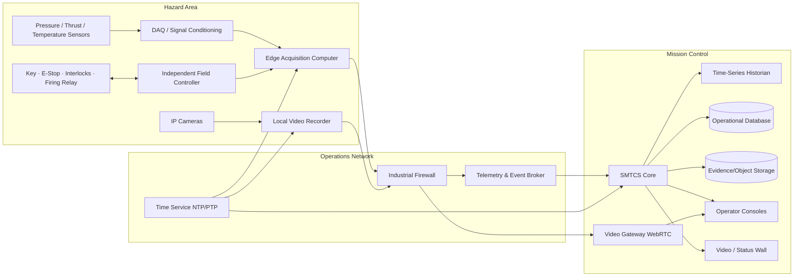
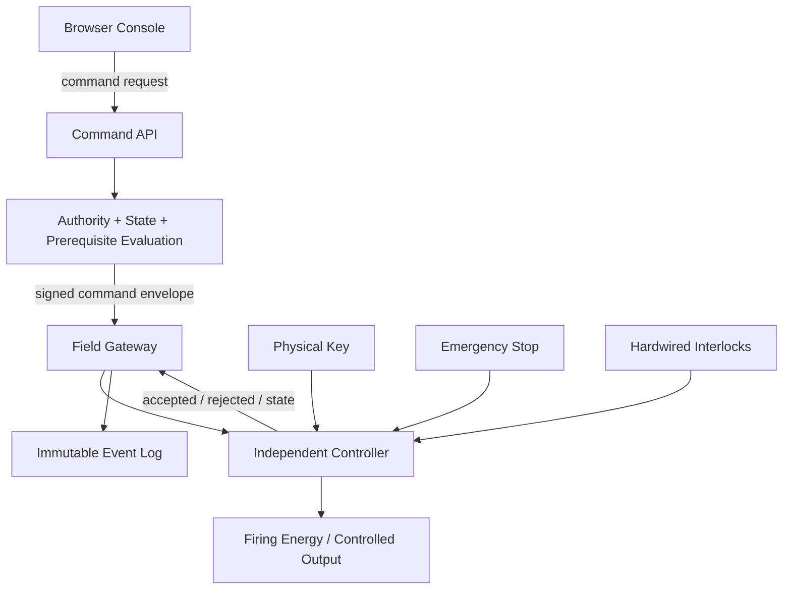
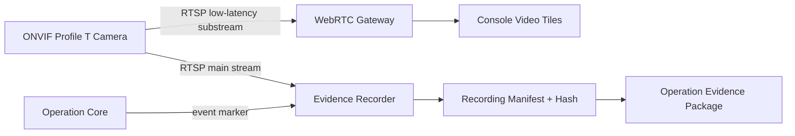

# 02 — System Architecture

## 1. Physical topology



## 2. Safety/control boundary



Rules:

- The API sends requests, not raw relay toggles.
- The field controller independently evaluates physical key, E-stop, interlocks, local mode, watchdog, and command validity.
- Commands have unique IDs, sequence numbers, issue time, expiry, intended target, requested transition, and authenticated origin.
- Timeouts are not retried automatically.
- On reboot, the controller returns to SAFE and requires local re-establishment of authority.
- Browser, API, and database failure must not energise an output.

Detailed wiring, firing-energy design, and safety integrity level require qualified electrical/safety engineering and site-specific hazard analysis; they are not delegated to the web application.

## 3. Logical services

| Service | Responsibility | Persistent output |
|---|---|---|
| Operation Orchestrator | State machine, attempt lifecycle, holds, aborts | operation state/events |
| Procedure Engine | Revision-pinned steps, branching, performer/verifier | step execution records |
| Authority Service | Active role assignments and command permissions | grants/revocations |
| Device Registry | Devices, adapters, capabilities, health | device configuration |
| Telemetry Gateway | Normalisation, timestamps, quality, limits | channel stream |
| Historian | High-rate raw and derived time series | immutable data segments |
| Alarm Service | limit, stale, disconnect, system alarms | alarm lifecycle |
| Video Gateway | RTSP/ONVIF intake, WebRTC distribution | stream sessions |
| Recorder Supervisor | recording state, storage, pre/post roll | recording manifest |
| Time Authority | offset/uncertainty monitoring | clock-health events |
| Command Gateway | field command envelope and acknowledgements | command ledger |
| Evidence Service | files, hashes, relationships, retention | evidence manifest |
| Report Service | quick-look and signed final packages | reports |
| Audit Service | append-only user/system event record | audit chain |

## 4. Network zones

```text
Zone A — Safety Control
  Independent controller, key/arm panel, E-stop, critical I/O.
  No direct internet route. Strict allow-list to field gateway.

Zone B — Instrumentation
  DAQ, loggers, sensor gateways, flight-electronics ground link.

Zone C — Video
  ONVIF cameras, PoE switches, NVR, video gateway.
  High bandwidth isolated from control traffic.

Zone D — Mission Operations
  Core servers, databases, operator consoles, display wall.

Zone E — Administration
  Configuration, reporting, backup, software maintenance.
```

Inter-zone traffic is allow-listed. Internet availability is not an operational dependency.

## 5. Sensor data path

```text
Transducer
→ signal conditioning
→ ADC/DAQ sample
→ device timestamp
→ edge adapter
→ canonical channel message
→ broker
→ historian + alarm service + live display
```

Canonical sample:

```json
{
  "operation_id": "OP-2026-001",
  "source_id": "DAQ-01",
  "channel_id": "motor.chamber_pressure",
  "sequence": 348122,
  "source_time_utc": "2026-08-17T08:42:16.183241Z",
  "receive_time_utc": "2026-08-17T08:42:16.187902Z",
  "value": 6.72,
  "unit": "MPa",
  "quality": "GOOD",
  "calibration_revision": "CAL-PT01-R03"
}
```

Mandatory qualities: `GOOD`, `STALE`, `INVALID`, `OUT_OF_RANGE`, `DISCONNECTED`, `UNCALIBRATED`, `SIMULATED`.

## 6. Supported adapter classes

- Serial/USB framed data.
- RS-485 / Modbus RTU.
- Modbus TCP.
- CAN/CAN-FD.
- OPC UA.
- MQTT with TLS for non-safety telemetry.
- UDP/TCP mission packets.
- File replay for training and analysis.
- Existing logger file import.
- ONVIF Profile T discovery/management and RTSP video intake.

Every adapter implements connect, identify, configure, health, time-offset, start-recording, stop-recording, and diagnostic interfaces. An adapter failure cannot crash the operation core.

## 7. Time architecture

- One site time authority serves the operations network.
- NTP is acceptable for the first low-rate prototype; PTP is used where sub-millisecond correlation is required and supported.
- Every record stores source time and receive time.
- Clock offset, jitter, last sync, and uncertainty are monitored as channels.
- Ignition/firing events originate from the field controller and are correlated to DAQ and video.
- Video uses recorder timestamps plus a common visible/metadata reference where practical.
- The operation report states achieved timing uncertainty; it does not claim false precision.

## 8. Video architecture



Required camera health fields: reachability, stream state, recording state, codec, resolution, frame rate, bitrate, packet loss where available, storage target, clock offset, and last frame time.

## 9. Data retention and evidence

Each attempt produces a sealed manifest referencing:

- pinned configuration and procedure revisions;
- personnel and authority assignments;
- complete command/acknowledgement ledger;
- procedure execution;
- alarm and hold histories;
- raw telemetry segments and checksums;
- derived data with algorithm/version provenance;
- video files and checksums;
- photographs and attachments;
- anomalies and dispositions;
- quick-look and final reports.

Large data is stored outside the relational database. The database stores identity, metadata, relationships, lifecycle, and integrity hashes.

## 10. Environments

| Environment | Purpose | May connect to hazardous hardware? |
|---|---|---|
| Development | coding and unit tests | No |
| Simulation | device simulators and rehearsals | No |
| Hardware-in-the-loop | controlled interface verification | Only approved test fixtures |
| Operations | authorised field execution | Yes, through independent controller |
| Analysis | replay and reporting | Read-only evidence |

The interface must show the active environment continuously. Simulated data is visibly and permanently marked.

